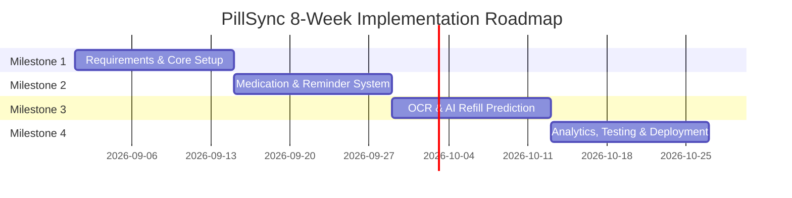

# PillSync — Team Allocation & Project Execution Plan

**Project Title:** PillSync: Intelligent Medicine Reminder and Medication Tracking Platform  
**Team Size:** 3 Members  
**Program:** Infosys Springboard Internship  
**Document Version:** 1.0 (Initial Proposal)  
**Last Updated:** August 30, 2026  

---

## 1. Executive Summary

**PillSync** is an AI-powered healthcare platform designed to assist patients, caregivers, and administrators with chronic disease management, dosage scheduling, adherence monitoring, OCR prescription parsing, and automated refill predictions.

Our 3-member team is divided into **Frontend (1 Engineer)** and **Backend (2 Engineers)** to ensure focused execution, modular code quality, and seamless API integration.

---

## 2. Team Structure & Role Assignment

| Team Member | Role | Primary Responsibilities | Core Tech Stack |
| :--- | :--- | :--- | :--- |
| **Yogesh Y Pagar** | **Frontend Engineer** | UI/UX Design, React SPA development, State Management, Axios API integration, Responsive Layouts, Client-side routing, Role-based view rendering. | React.js, Tailwind CSS, Axios, React Router, Redux Toolkit / Context API, Vitest |
| **Advala Indhu** | **Backend Engineer (Core & AI/OCR)** | RESTful API Development, User Authentication (JWT/OAuth2), Database Schema Design, OCR & NLP Pipeline integration for prescription processing. | Python, Django REST / FastAPI, PostgreSQL, Tesseract OCR, spaCy, Pytest |
| **Vemula Purna** | **Backend Engineer (Logic & Services)** | Refill Prediction Engine, Reminder & Scheduler service, Push/Email/SMS Notification pipelines, Analytics API, Background workers. | Python, Django REST / FastAPI, Celery, Redis, Firebase FCM, Twilio, SendGrid |

---

## 3. Module Ownership Matrix

The project consists of 10 primary modules. The table below outlines how responsibilities are split across Frontend and Backend team members:

| # | Module Name | Backend Lead(s) | Frontend Lead | Key Deliverables |
| :-: | :--- | :--- | :--- | :--- |
| **1** | **Authentication & Role Access** | Advala Indhu | Yogesh Y Pagar | JWT Login/Register, Session handling, Role-based route protection (Patient, Caregiver, Admin). |
| **2** | **Profiles & Medication Management** | Advala Indhu | Yogesh Y Pagar | Profile creation, Adding/editing medicine schedules, Disease tagging (BP, Diabetes, etc.). |
| **3** | **Prescription Upload & OCR** | Advala Indhu | Yogesh Y Pagar | Image file upload UI, Tesseract/NLP backend processing, Extraction review form. |
| **4** | **Smart Reminder System** | Vemula Purna | Yogesh Y Pagar | Dose status triggers (Taken/Missed/Snooze), Scheduling logic, Real-time UI alerts. |
| **5** | **Medication Adherence Tracking** | Vemula Purna | Yogesh Y Pagar | Adherence calculation algorithms, Adherence log views, Weekly/Monthly compliance lists. |
| **6** | **AI Refill Prediction Engine** | Vemula Purna | Yogesh Y Pagar | Stock depletion calculations, Low-stock warnings UI, Recommended refill date indicators. |
| **7** | **Disease-Based Organization** | Advala Indhu | Yogesh Y Pagar | Categorized medicine filtering, Disease-wise adherence dashboards. |
| **8** | **Smart Notifications & Alerts** | Vemula Purna | Yogesh Y Pagar | Multi-channel delivery (Push, Email, SMS), Caregiver emergency notification triggers. |
| **9** | **Dashboard & Analytics** | Vemula Purna | Yogesh Y Pagar | Data aggregation endpoints, Visual charts (Recharts / Chart.js) for compliance & stock trends. |
| **10**| **Testing, CI/CD & Deployment** | Joint Team | Yogesh Y Pagar | End-to-end API integration, Docker deployment, CI/CD pipeline verification, Demo presentation. |

---

## 4. Frontend Architecture & Folder Structure (Yogesh Y Pagar)

The frontend is structured modularly inside `frontend/src/` to ensure maintainability and separation of concerns:

```text
frontend/src/
├── api/             # Axios instances, interceptors, API service helper functions
│   ├── axiosInstance.js
│   ├── authApi.js
│   ├── medicationApi.js
│   ├── ocrApi.js
│   └── refillApi.js
├── assets/          # Static assets (Logos, icons, illustrations)
├── components/      # Shared reusable UI elements
│   ├── common/      # Buttons, Inputs, Modals, Spinners, Badges
│   ├── layout/      # Navbar, Sidebar, Footer, Page Containers
│   └── charts/      # Reusable chart components (Adherence & Refill graphs)
├── context/         # React Contexts (AuthContext, ThemeContext, NotificationContext)
├── features/        # Business logic grouped by feature module
│   ├── auth/        # Login & Register forms
│   ├── medications/ # Medicine forms, Dose cards, Disease filters
│   ├── ocr/         # Prescription scanner UI
│   ├── reminders/   # Active reminders modal & dose actions
│   ├── refills/     # Stock tracker & prediction cards
│   └── caregiver/   # Patient monitoring dashboard for caregivers
├── hooks/           # Custom React hooks (useAuth, useFetch, useReminders)
├── pages/           # Route pages
│   ├── HomePage.jsx
│   ├── LoginPage.jsx
│   ├── DashboardPage.jsx
│   ├── MedicationsPage.jsx
│   └── CaregiverPage.jsx
├── routes/          # App router & role-protected route guards
├── styles/          # Tailwind CSS styles and custom design tokens
└── utils/           # Helper functions (Date formatting, stock calculation helpers, validators)
```

---

## 5. Milestone & Implementation Roadmap



### **Milestone 1 (Weeks 1–2): Core Setup, Auth & Database**
* **Backend (Indhu & Purna):** Database schema design (PostgreSQL), JWT Authentication setup, User Profile REST endpoints.
* **Frontend (Yogesh):** React Vite initialization, Tailwind CSS setup, Base layout (Navbar, Sidebar), Auth pages (Login/Register), Route guards.

### **Milestone 2 (Weeks 3–4): Medication Management & Reminders**
* **Backend (Indhu & Purna):** Medication CRUD APIs, Disease categorisation, Reminder scheduling engine (Celery/Cron).
* **Frontend (Yogesh):** Medicine management dashboard, Add/Edit dose forms, Reminder notification popups (Taken/Missed/Snooze).

### **Milestone 3 (Weeks 5–6): OCR Recognition & AI Refill Prediction**
* **Backend (Indhu & Purna):** Tesseract OCR pipeline for prescriptions, AI Refill estimation algorithm, Notification integrations (Twilio/SendGrid/FCM).
* **Frontend (Yogesh):** Prescription upload interface with OCR review table, Stock level progress bars, Refill date prediction badges.

### **Milestone 4 (Weeks 7–8): Analytics, Testing & Deployment**
* **Backend (Indhu & Purna):** Analytics data aggregation APIs, Performance tuning, Integration unit testing.
* **Frontend (Yogesh):** Interactive Analytics Dashboard (graphs/reports), Caregiver multi-patient dashboard, End-to-end testing, Production build.

---

## 6. Progress Tracking & Mentor Review Log

*(This section will be updated at every weekly mentor review meeting)*

| Date | Milestone | Status | Completed Highlights | Next Week Goals | Mentor Feedback |
| :--- | :--- | :--- | :--- | :--- | :--- |
| **Week 2** | Milestone 1 | ⏳ In Progress | Repository layout, Folder structure, Environment setup | Complete Auth API & Login UI | — |
| **Week 4** | Milestone 2 | 📅 Pending | — | — | — |
| **Week 6** | Milestone 3 | 📅 Pending | — | — | — |
| **Week 8** | Milestone 4 | 📅 Pending | — | — | — |

---

## 7. Next Steps & Action Items

1. **API Protocol Alignment:** Confirm API request/response JSON schemas between Frontend (Yogesh) and Backend (Indhu & Purna).
2. **Git Branching Strategy:** Maintain work on respective feature branches and submit code via regular pushes.
3. **Environment Setup:** Initialize local Docker / `.env` settings for API URL endpoints.
