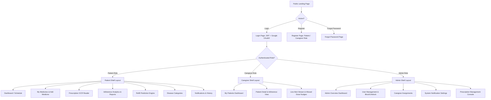
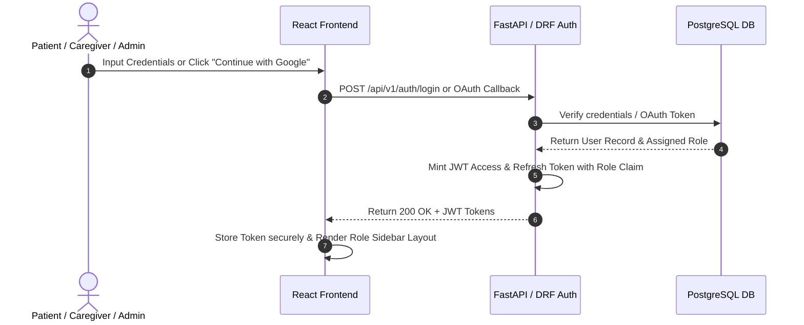
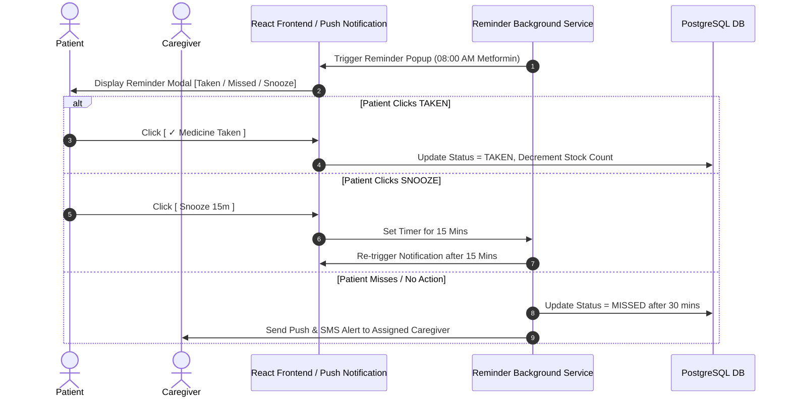
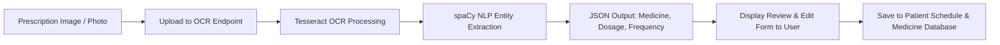

# PillSync — System Architecture & Complete Workflow Planning

**Author:** Rajasri Nallamilli (Intern #03)  
**Module Scope:** Milestone 1 — Comprehensive System Workflow Planning  
**Target Platform:** PillSync Intelligent Medicine Reminder & Tracking Platform  
**Color System:** Crimson & Ruby Red (`#ED4264`, `#DC143C`)

---

## 1. Complete Workflow Architecture

PillSync supports 25 distinct screen workflows across 3 distinct security roles (**Patient**, **Caregiver**, **Admin**) and public authentication states.

---

## 2. Detailed System Sequence Diagrams

### 2.1 Workflow 1: Authentication & Role-Based Token Flow

### 2.2 Workflow 2: Smart Medicine Intake & Snooze Escalation Flow

### 2.3 Workflow 3: Prescription OCR Extraction & Schedule Creation

