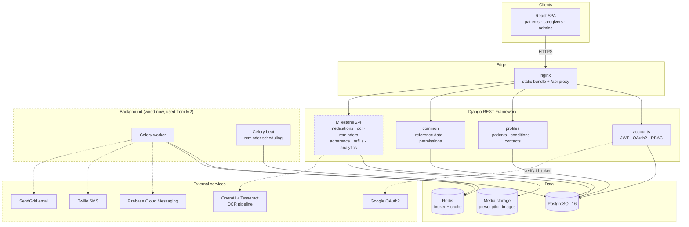
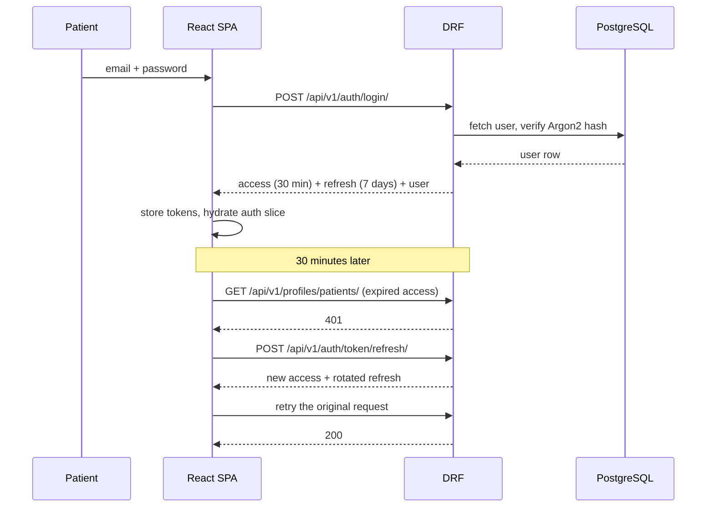
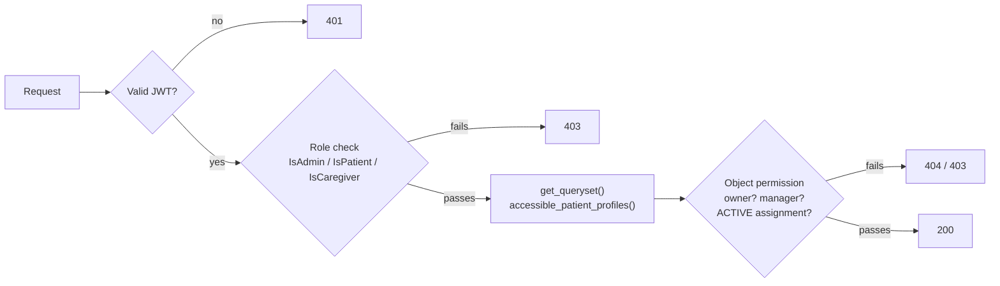
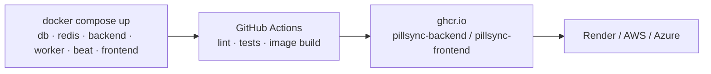

# Architecture

**Milestone 1 deliverable — system architecture and tech decisions.**

## System overview

Dashed boxes are wired but not yet exercised: Milestone 1 delivers the solid
path — browser to API to PostgreSQL.

## Request path: signing in

The refresh and replay happen inside `src/api/client.js`; no feature code sees a
401. Concurrent 401s share one refresh call, so ten requests firing after
expiry do not start ten refreshes.

## Authorisation model

Three layers, and the middle one matters most: every profile endpoint filters
through `accessible_patient_profiles()`, so a record the caller may not see is
never in the queryset to begin with. A forgotten object-permission check cannot
leak data, because the row was never fetched. The list endpoint returns 404 for
someone else's id rather than 403 — a 403 would confirm the record exists.

## Technology decisions

| Decision | Chosen | Why |
|---|---|---|
| Backend framework | Django REST Framework | The specification's first choice. Its ORM, migrations, admin and auth cover most of Milestone 1 with code we do not have to write or test. |
| Database | PostgreSQL 16 | Named in the specification. Partial unique indexes (one primary emergency contact per patient) and JSONB (secondary medicine categories) are both used. |
| Auth | JWT (SimpleJWT) + Google OAuth2 | Stateless tokens suit a SPA plus the future mobile client. Refresh rotation with blacklisting means a stolen refresh token is usable once. |
| Password hashing | Argon2 | Memory-hard, and the current OWASP recommendation. |
| Primary keys | UUIDv4 | Ids appear in URLs shared between patient and caregiver. |
| API schema | drf-spectacular | The OpenAPI document is generated from the code, so `docs/api/openapi.yaml` cannot drift from what the server actually does. |
| Background jobs | Celery + Redis | Reminders in Milestone 2 need scheduled, retryable delivery. Configured now so Milestone 2 adds tasks rather than plumbing. |
| Frontend build | Vite + React 19 | Fast dev server, and the specification names React. |
| Frontend state | Redux Toolkit | Session state is read by nearly every screen; prop drilling it would be worse. Server data uses a small `useApi` hook instead — it is cache, not state. |
| Styling | Tailwind CSS v4 | Named in the specification. v4 needs no config file. |
| Tests | pytest + Vitest | pytest is specified. Vitest shares Vite's transform pipeline, so tests and build never disagree. |

## Security posture at Milestone 1

- Argon2 password hashing, with Django's validators plus a 10-character minimum.
- Access tokens live 30 minutes; refresh tokens rotate and the old one is blacklisted.
- Login is throttled to 10/min, registration and password reset to 5/hour — the
  endpoints where trying repeatedly is the whole attack.
- Password reset says the same thing whether or not the address is registered,
  so it cannot be used to enumerate accounts. Login does the same.
- Google ID tokens are verified against Google's public keys **and** our own
  client id; without the audience check, a token minted for any other
  application would be accepted.
- Every credential comes from the environment. `scan_secrets.py` runs in CI on
  every push.
- Production settings refuse to start without a real `SECRET_KEY` and
  `ALLOWED_HOSTS`, and force HTTPS, HSTS and secure cookies.
- Uploads are capped at 10 MB, which matters from Milestone 3.

## Deployment

`docker-compose.yml` runs the whole stack locally. CI builds both images on
every push once there is an app to containerise; the CD workflow publishes them
on demand in Milestone 4.
