# OCR, refill prediction and analytics

**Milestones 3 and 4 — how the intelligent parts work, and why they are built this way.**

Three design rules run through everything here, because the failure that matters
in a medication app is not a crash but a *confident wrong answer*:

1. **Fail loudly, never silently.** A medicine the reader could not understand
   appears on screen with a reason; it is never dropped, and never saved with
   guessed details.
2. **Never apply an uncertain match automatically.** Uncertain means *suggest*, and
   a person decides.
3. **Say what the number is.** Confidence, accuracy and forecasts are shown with
   their basis and limits, not as bare percentages.

## 1. Prescription OCR

```mermaid
flowchart LR
    A[Photo or pasted text] --> B[Validate<br/>size · format · pixels · openable]
    B --> C[Preprocess<br/>orient · grayscale · scale · contrast]
    C --> D[OCR engine<br/>Tesseract, pluggable]
    D --> E[Parse<br/>header · medicine blocks · fields]
    E --> F[Match to the medicine catalogue<br/>3,111 real presentations]
    F --> G{confidence}
    G -->|confident, page read well| H[Applied, shown as matched]
    G -->|doubtful, or page read badly| I[Suggested, never applied]
    H --> J[Patient reviews and edits]
    I --> J
    J -->|Add to my medicines| K[Medicines · schedules · reminders<br/>stock ledger · refill forecast]
```



A photo and typed text take the same path from step E: a patient whose photo will
not read can paste what they see and go through the identical review.

**Pipeline** (`apps/ocr/services/`)

| Step | Module | Notes |
|---|---|---|
| Validate | `serializers.py` | Size limit, allowed formats (JPEG, PNG, WEBP, TIFF), minimum 200 px a side, and a **pixel-count check from the header before decoding** — a crafted file can be kilobytes on disk and gigabytes in memory |
| Preprocess | `preprocess.py` | Pillow only: EXIF orientation, grayscale, upscale small images, autocontrast. No OpenCV, which would add a large native dependency for little gain at this stage |
| Read | `engines.py` | `TesseractEngine` via `pytesseract.image_to_data`, which returns a confidence **per word** — that is what lets the screen say "this line was hard to read". The engine is a dotted path in settings, so a hosted engine (Google Vision, Azure) can replace it for handwriting without touching the pipeline, and tests inject a fake |
| Parse | `parser.py` | Pure Python, no Django. Deterministic rules over the layouts real prescriptions use |
| Match | `matcher.py` | Fuzzy match on ingredient names with generic ⇄ brand alias tables, strength and form agreement. Thresholds: automatic ≥ 0.86, suggestion ≥ 0.75 |
| Persist | `pipeline.py` | `process_job` never raises: a failure becomes a `FAILED` job with a plain-language reason |

**What the parser understands.** `1-0-1` (morning-afternoon-night), `BD`, `TDS`,
`OD`, `QID`, "twice daily", "every 8 hours", "at bedtime", weekly and alternate-day
dosing, "on Mon/Wed/Fri", durations ("x 30 days", "for 2 weeks"), printed
quantities, "as needed" / SOS, numbered lists, lines run together, a form word
before *or after* the strength, and common OCR confusions (`O` for `0`, `l` for `1`,
`|` for `1`). It also reads the header: doctor, clinic, date, reference number,
patient name (a mismatch with the profile raises a warning), and expiry.

**Why rules, not spaCy or an LLM.** The specification mentions spaCy or OpenAI for
parsing. Rules were chosen deliberately: prescription abbreviations are a small,
closed vocabulary that rules handle exactly and testably; the output is
deterministic and offline, so a scan of a medical record never leaves the server;
and a wrong answer can be traced to a line of code. A language model is the
natural next step for free-text instructions the rules do not cover, and the
pipeline's shape (parse → match → review) would not change.

**Safety rules in the pipeline**

- *Nothing is added until the patient presses the final button.* Unsaved edits and
  missing stock counts disable it.
- *A confident catalogue match is applied; a doubtful one is only suggested*, and a
  suggestion is never applied silently — wrongly attaching a catalogue entry
  attaches its strength and category too. Known look-alikes (rosiglitazone /
  pioglitazone) are tested never to auto-match.
- *A poorly read page downgrades every match to a suggestion.* Below 0.5 mean OCR
  confidence, the "name" may be a misread of a different real drug (the OCR
  evaluation found exactly one such case).
- *Nothing is lost.* Two medicines on one line are both extracted; a line with no
  dose times is kept with the reason "No dose times found".
- *Assumptions are stated.* "Written as once daily with no time, so morning was
  assumed"; "Quantity worked out as 60, not printed on the page".
- *Typos are corrected only when unambiguous.* "Metformn" becomes "Metformin"; the
  synonym "Paracetamol" is never rewritten to the catalogue's "Acetaminophen".
- *Privacy.* The original photo is served only through an authenticated endpoint
  (never a public media path) with `Cache-Control: private, no-store`; scans not
  added to a medicine list are deleted, image included, after 30 days (nightly
  job); a confirmed scan's prescription record owns its image.

**Measured behaviour**: [`docs/reports/ocr-evaluation.md`](../reports/ocr-evaluation.md).

## 2. Refill prediction

The specification's inputs are initial quantity, daily frequency, quantity per
dose, missed-dose history and manual stock updates. The first, third and fifth are
folded into one number — **what is in the patient's hand right now** — because
that already reflects every dose taken and every correction. That leaves the
interesting question: *how fast will it be used?*

```
average daily use  =  w × observed  +  (1 − w) × scheduled
w                  =  min(1, resolved doses in the last 14 days ÷ 10)
days remaining     =  stock ÷ average daily use
runs out on        =  today + floor(days remaining)
refill by          =  runs out − 5 days   (REFILL_LEAD_TIME_DAYS)
```

The **scheduled** rate is right on day one and wrong for anyone who misses doses
(it says "runs out sooner than you will"). The **observed** rate is accurate once
there is history and noisy without it. The blend uses the schedule until history
builds and the patient's real behaviour once it has. The weight `10` was chosen
from the backtest ([`refill-evaluation.md`](../reports/refill-evaluation.md)):
5, 10 and 20 differ by under a day of error, and the point is using history at
all.

**Worked examples** (from `apps/refills/engine.py`, today = 1 March 2026)

| Case | Stock | Uses/day | Result |
|---|---:|---:|---|
| The specification's example | 60 tablets | 2 | 30 days → runs out **31 March**, refill by **26 March**, status OK |
| Takes 22 in 14 days instead of the scheduled 28 | 60 | 1.57 observed, weight 1.0 | 38.2 days → runs out **8 April**, refill by **3 April** |
| Only 4 days of history | 60 | 1.5 observed → 1.70 blended, weight 0.6 | History counts, but the schedule still anchors it |
| Nearly out | 8 | 2 | **LOW**: 4 days → refill by today |
| Almost gone | 4 | 2 | **CRITICAL**: runs out 3 March |
| Course ends first | 14 | 2, course ends 7 March | **COVERED**: it will not run out before the course does — no false alarm |

**Statuses:** `OK`, `COVERED`, `UNKNOWN` (stock but no schedule — nothing to
predict), `LOW` (run-out within the lead time), `CRITICAL` (within half of it),
`OUT`.

**Details that matter**

- Only *complete* days count as observed — today is still in progress, and counting
  this morning's dose against a full day would understate use.
- *Skipped* doses are left out of consumption: they were deliberately not taken, so
  they are neither "used" nor "missed".
- Fractional rates (a weekly medicine) are floored with a small epsilon;
  `Decimal(1)/7` is not exact, and a bare floor would report 27 days for 4 tablets
  used once a week instead of 28.
- Stock only changes through a dose, a refill or a counted correction, each written
  to the **`StockEvent` ledger** — so a forecast that suddenly moved can be
  explained. A bare `PATCH` of `quantity_remaining` is refused.
- A stopped medicine has no prediction; keeping one would go on warning about a
  medicine the patient no longer takes.

**Alerts.** Each prediction remembers the worst level already announced this cycle
(`alert_level`). A notification goes out only when the level *rises*, so a patient
hears once that stock is low, once that it is nearly gone, once that it has run
out — never a fourth time for the same shortfall. The level resets when stock
recovers, so the next cycle starts fresh. Caregivers with alerts enabled are told
too, because the person who goes to the pharmacy is often not the patient.

**When it runs.** On every dose taken, refill, stock count, schedule edit and
medicine change (so the screen is never stale), and nightly at 06:00 (because the
forecast also moves with the calendar — yesterday's "fine" is a day closer to
running out).

## 3. Adherence

Definitions, fixed once so every screen, report and export agrees
(`apps/adherence/engine.py`, tested against an independent calculation):

- A dose is **resolved** when Taken or Missed. Pending and snoozed doses are still in progress.
- **Skipped** doses are excluded entirely: "my doctor told me to stop" is not a failure.
- **Adherence** = taken ÷ (taken + missed). With nothing resolved it is `null`, never 0% or 100%.
- **On time** = taken within 60 minutes of the scheduled time.
- A **perfect day** has at least one taken dose and no missed one; days with no resolved doses neither extend nor break a streak.
- **Consistency** = perfect days ÷ days with resolved doses.
- **Trend** compares the second half of the window with the first (±5 points); with no data in one half it says "unknown" rather than inventing a direction.
- **Patterns** (worst time of day, weekday, medicine) are reported only from at least 8 resolved doses and only when clearly worse than the overall miss rate.

There is no adherence table: it is computed from `DoseEvent`, the same rows that
drove the reminders. Milestone 2 made that choice so this would need no new storage.

## 4. Analytics, dashboards and performance

- **Patient dashboard** (`/analytics/dashboard/`): today, streaks, 7- and 30-day
  adherence, the daily series, missed-dose patterns and the refills needing
  attention — one round trip, read once from the dose history.
- **Caregiver overview** (`/analytics/caregiver/`): one row per patient with an
  *explainable* attention score — each reason ("Adherence is 62% this week", "1 dose
  missed today", "2 medicines about to run out") is listed, so the caregiver knows
  which patient to call first and why.
- **Administrator analytics** (`/analytics/admin/`): users, activity, adherence,
  notification delivery (per channel), OCR volume/success/confirmation/latency,
  refill status, and forecast accuracy.
- **Charts** are hand-written SVG (four types, about 300 lines) rather than a
  charting library: the bundle stays small (131 kB gzipped total), and each chart
  carries a text alternative and per-bar tooltips with exact figures. No-data is
  drawn as "no data", never as zero.
- **Timing.** `RequestTimingMiddleware` adds `Server-Timing` to every response,
  logs slow requests, and keeps a rolling window of the last 5,000 requests
  bucketed by *route template* (`/medicines/<uuid>/` is one bucket, not one per
  medicine). It is in-memory per process — a sample, not a census; a real
  deployment would add an APM.

## What is deliberately not here

- **Handwriting.** Tesseract does not read it reliably. The engine seam exists for
  a hosted engine; none is wired.
- **spaCy / OpenAI parsing** (see above), and OpenCV preprocessing.
- **Real notification delivery.** Providers fall back to the console without credentials.
- **A trend term in the forecast.** A patient whose habits are changing (fading
  motivation) still gets a run-out date off by over a week — the largest known error.
- **Photos on object storage.** They live on the server's disk (a volume); see the deployment guide.
