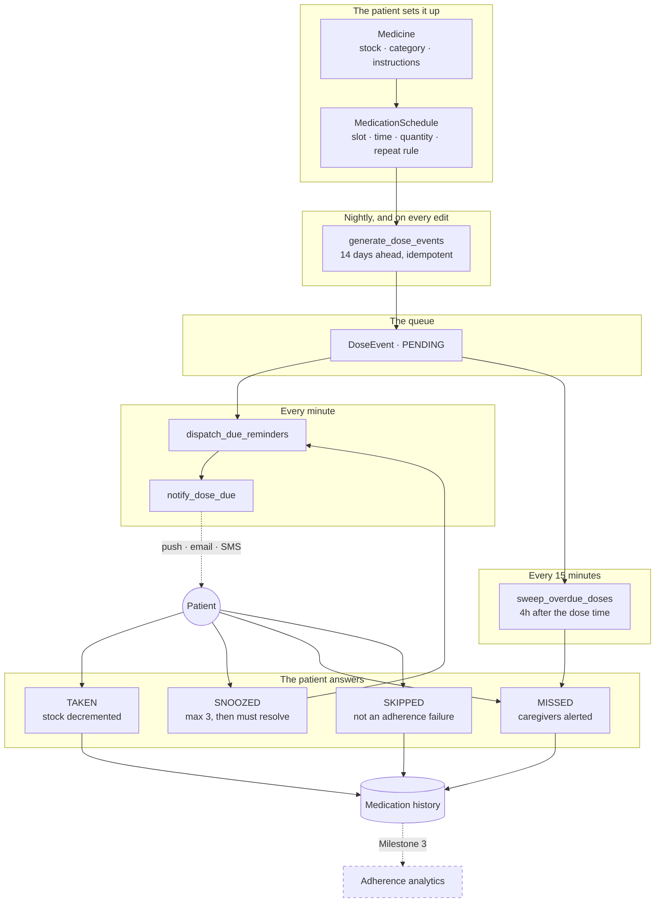
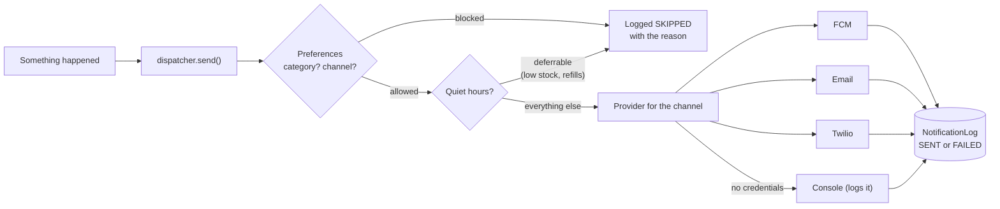

# The reminder pipeline

**Milestone 2 deliverable — how a dosage schedule becomes a reminder, and what
happens to the answer.**

## The one idea

A `MedicationSchedule` is a *rule*: "2 tablets at 08:00, every day". A
`DoseEvent` is one dated instance of that rule: "2 tablets at 08:00 on Tuesday
the 8th".

Dose events are created ahead of time rather than computed on the fly, and that
single decision makes everything downstream simple:

- a **reminder** is a row to send,
- **medication history** is the same rows, after the fact,
- **adherence** (Milestone 3) is a count of those rows,
- and a patient tapping *Taken* on Tuesday's dose has somewhere to record it.

Computing doses on demand would give you the first, but nowhere to put the
patient's answer, and no way to tell a dose nobody responded to from one that
was never due.

## From schedule to history

## The four background tasks

| Task | Cadence | What it does |
|---|---|---|
| `dispatch_due_reminders` | every minute | Sends reminders for doses that have come due, and for snoozes that have run out |
| `sweep_overdue_doses` | every 15 minutes | Marks doses unanswered after 4 hours as missed, alerting caregivers |
| `generate_dose_events` | 02:00 daily | Tops the 14-day horizon back up |
| `notify_expiring_prescriptions` | 08:00 daily | Warns 7 days before a prescription lapses, and retires the ones that already have |

Each is idempotent. Celery beat can double-fire after a restart, and a reminder
sent twice is worse than one sent a minute late.

## Decisions worth knowing

**Times are local to the patient, not the server.** An 08:00 dose means 08:00
where the patient is. `PatientProfile.timezone_name` drives it, and an
unparseable value falls back to UTC with a warning rather than crashing the
generation run for everybody.

**Generation never back-fills.** A schedule added today does not invent a
history of doses the patient never had the chance to take — that would show up
as a wall of missed doses and destroy the adherence figure before they started.

**Editing a schedule only moves untouched doses.** `regenerate_for_schedule`
drops future `PENDING` doses whose reminder has not been sent, then regenerates.
Anything the patient already answered, or that has already reminded them, is
left exactly as it is.

**Snoozes are capped at three.** An uncapped snooze lets a dose stay open
forever, which is indistinguishable from being ignored but never surfaces as
missed. After three, the patient has to say what actually happened.

**Skipped is not Missed.** "My doctor told me to stop the antibiotic" is not an
adherence failure. Skipped doses are excluded from the denominator, so the
Milestone 3 percentages measure what they claim to.

**Stock decrements only on Taken.** Remaining quantity therefore reflects doses
actually confirmed, which is what the refill engine will predict from. Stock
floors at zero rather than going negative — recorded stock can be wrong, and a
patient with tablets we do not know about must never be blocked from recording
a dose.

## Notification delivery

**Every attempt is logged, including the skipped ones.** "Why didn't I get a
reminder?" has to be answerable, and reminder delivery success rate is a graded
performance metric in Milestone 4.

**Quiet hours are narrow on purpose.** They hold back low-stock, refill and
prescription-expiry notices only. A dose reminder fires at a time the patient
chose themselves — silencing it during their own quiet hours would break exactly
the 06:00 thyroid tablet and the 22:30 statin, which are the doses people
forget. Missed-dose and caregiver alerts are urgent by definition.

**An unconfigured provider falls back to the console.** The whole pipeline runs
end to end without a Firebase project, a Twilio number or a SendGrid key, so a
developer sees real behaviour on day one and CI needs no secrets.

**A dependent profile's reminders go to whoever manages it.** A profile with no
login of its own would otherwise have nowhere to send.

## What Milestone 3 adds on top

Nothing here changes. The OCR pipeline fills in `Prescription` and creates
`Medicine` rows from an uploaded photo; the refill engine reads
`Medicine.quantity_remaining` and `MedicationSchedule.doses_per_day()` to
predict a depletion date; adherence analytics aggregate the `DoseEvent` rows
this milestone already produces.
