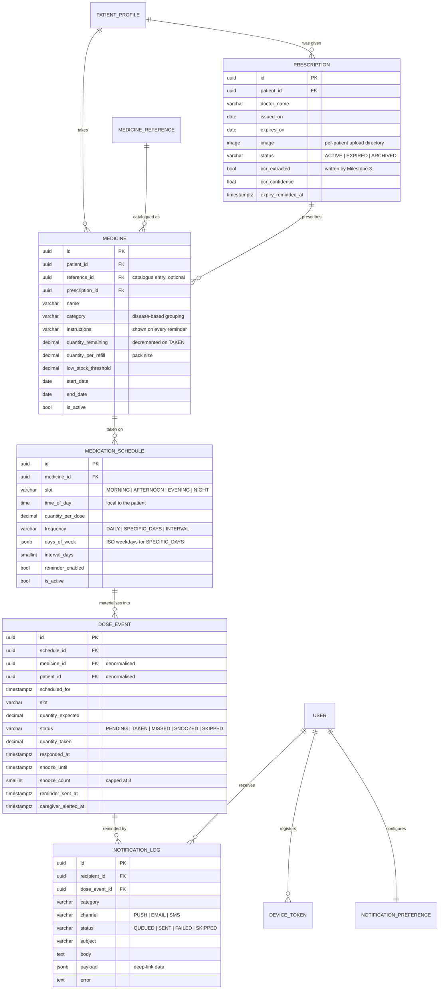
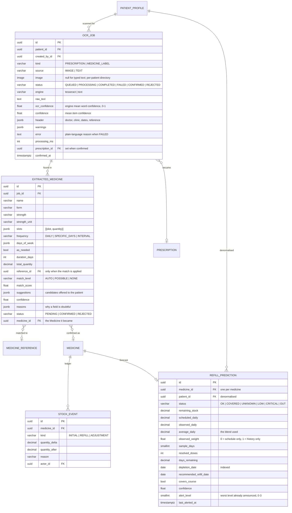

# Database schema

**Milestone 1 deliverable — "Database schema finalized".**

PostgreSQL 16 in every deployed environment; SQLite is the local fallback so a
fresh clone runs without a database server. `DATABASE_URL` overrides both.

## Entity relationship diagram

```mermaid
erDiagram
    USER ||--o| PATIENT_PROFILE : "has own"
    USER ||--o{ PATIENT_PROFILE : manages
    USER ||--o| CAREGIVER_PROFILE : "has"
    USER ||--o{ CAREGIVER_ASSIGNMENT : "is caregiver in"
    USER ||--o{ CAREGIVER_ASSIGNMENT : "is patient in"
    PATIENT_PROFILE ||--o{ EMERGENCY_CONTACT : "reachable via"
    PATIENT_PROFILE ||--o{ PATIENT_CONDITION : "treated for"
    MEDICAL_CONDITION ||--o{ PATIENT_CONDITION : "recorded as"
    MEDICAL_CONDITION }o--|| MEDICINE_CATEGORY : "usually treated with"
    MEDICINE_REFERENCE }o--|| MEDICINE_CATEGORY : "belongs to"

    USER {
        uuid id PK
        citext email UK "sign-in identity"
        varchar full_name
        varchar phone_number
        varchar role "PATIENT | CAREGIVER | ADMIN"
        varchar auth_provider "LOCAL | GOOGLE"
        bool is_email_verified
        bool is_active "deactivate, never delete"
        bool is_staff
        timestamptz date_joined
        inet last_login_ip
    }

    PATIENT_PROFILE {
        uuid id PK
        uuid user_id FK "null for a dependent"
        uuid managed_by_id FK "who is responsible"
        varchar full_name
        varchar relationship_to_manager
        date date_of_birth
        varchar gender
        varchar blood_group
        smallint height_cm
        decimal weight_kg
        text allergies
        varchar timezone_name "reminders fire locally"
        varchar preferred_reminder_channel
        bool is_self
        bool is_active
    }

    CAREGIVER_PROFILE {
        uuid id PK
        uuid user_id FK UK
        varchar organisation
        varchar qualification
        varchar license_number
        smallint years_of_experience
        bool is_professional
        bool is_verified
    }

    CAREGIVER_ASSIGNMENT {
        uuid id PK
        uuid caregiver_id FK
        uuid patient_id FK
        varchar relationship
        varchar status "PENDING | ACTIVE | REVOKED | DECLINED"
        bool can_view_adherence
        bool can_receive_alerts
        bool can_manage_medications
        uuid invited_by_id FK
        timestamptz responded_at
    }

    EMERGENCY_CONTACT {
        uuid id PK
        uuid patient_id FK
        varchar name
        varchar relationship
        varchar phone_number
        varchar email
        bool is_primary "at most one per patient"
    }

    PATIENT_CONDITION {
        uuid id PK
        uuid patient_id FK
        uuid condition_id FK
        date diagnosed_on
        varchar severity
        text notes
        bool is_active
    }

    MEDICAL_CONDITION {
        uuid id PK
        slug code UK
        varchar name
        varchar category
        bool is_chronic
        bool is_active
    }

    MEDICINE_REFERENCE {
        uuid id PK
        varchar product_ndc "FDA National Drug Code"
        varchar generic_name
        varchar brand_name
        varchar dosage_form
        varchar route
        varchar strength
        varchar strength_unit
        varchar category
        jsonb secondary_categories
        varchar pharm_class
        bool requires_prescription
        bool is_active
    }
```

Every table also carries `created_at` and `updated_at` from the shared
`UUIDTimeStampedModel` base.

## Decisions worth knowing

**UUID primary keys everywhere.** Record identifiers travel in URLs that both a
patient and their caregiver see. Sequential integers would leak how many
patients and prescriptions the platform holds, and make one patient's records
guessable from another's.

**`User` and `PatientProfile` are separate.** The specification requires
"multiple patient profiles for families". A parent tracking medicines for a
child or an elderly relative needs a profile for someone who has no login, so
`PatientProfile.user` is nullable and `managed_by` records who is responsible.

**One `User` model for all three roles.** A caregiver is very often also a
patient — an adult child managing their own medicines and their parent's.
Separate models would force that person to hold two accounts.

**Access is granted, not claimed.** A `CaregiverAssignment` starts `PENDING`;
only the patient (or an admin) moves it to `ACTIVE`, and only an `ACTIVE` one
confers any read access. The three permission flags let a patient share
adherence data without also handing over the ability to change medication.

**Nothing is deleted.** `is_active` flags retire users, profiles and conditions.
Medication history must outlive the account it belongs to, both clinically and
for the adherence analytics in Milestone 4.

## Constraints and indexes

| Table | Constraint | Why |
|---|---|---|
| `user` | `email` unique | Email is the sign-in identity |
| `caregiver_assignment` | unique `(caregiver, patient)` | One link per pair, whatever its status |
| `caregiver_assignment` | check `caregiver != patient` | Nobody is their own caregiver |
| `patient_profile` | unique `(managed_by, full_name)` | Two "Mother" profiles would be unusable |
| `emergency_contact` | unique `patient` where `is_primary` | Exactly one number to call first |
| `patient_condition` | unique `(patient, condition)` | A condition is recorded once |
| `medicine_reference` | unique `(generic, form, strength, unit)` | One row per presentation |

Indexes: `user(role, is_active)`, `caregiver_assignment(patient, status)`,
`patient_profile(managed_by, is_active)`, `patient_condition(patient, is_active)`,
`medicine_reference(category, is_active)` and `(generic_name, brand_name)`.
Each one backs a query the app runs on every page load.

## Reference data

`MEDICAL_CONDITION` and `MEDICINE_REFERENCE` are seeded, not user-entered:

```bash
python manage.py seed_reference_data
```

That loads 20 conditions and ~1,760 medicine presentations from
`backend/apps/common/data/`, built from the FDA National Drug Code Directory by
`ml/src/common/build_medicine_reference.py`. The command is idempotent — rows
are matched on their natural key and updated in place.

Patients link to these rows rather than typing free text, so "diabetes",
"Diabetes Type 2" and "T2DM" do not become three conditions the analytics
cannot group.

## Milestone 2 tables



### Decisions

**`DoseEvent` is both the reminder and the history record.** One row per
scheduled dose means "what did the patient do about Tuesday's 08:00 dose" has
exactly one answer. Splitting them would leave the two to drift.

**`patient_id` and `medicine_id` are denormalised onto `DoseEvent`.** The
history of a patient survives a schedule being deleted, and today's doses need
no joins.

**Unique `(schedule, scheduled_for)`.** Regenerating the horizon, or two workers
generating at once, cannot produce a doubled dose.

**Nothing is deleted here either.** Stopping a medicine deactivates it and drops
only its untouched future doses; a prescription is archived so the medicines
pointing at it keep their link.

## Milestone 3 tables

Four tables in two new apps. **Adherence and analytics need no tables**: they are
computed from `DOSE_EVENT`, the rows that drove the reminders.



### Decisions

**A scan is a *job*, not a prescription.** `OCR_JOB` holds what the engine and
parser produced, and `EXTRACTED_MEDICINE` holds each line for the patient to
review and correct. A `Prescription`, `Medicine` and `MedicationSchedule` exist
only after the patient confirms. Nothing the reader guessed can reach the medicine
list without a person deciding, and a discarded scan leaves no trace beyond the
job (which the nightly cleanup deletes with its image after 30 days).

**`reference` is null unless the match was applied.** A doubtful match lives in
`suggestions` and waits. Wrongly attaching a catalogue entry attaches its strength
and category too, so the column means "a match the system was sure of, or one the
patient chose".

**`REFILL_PREDICTION` is recomputed, not versioned.** One row per medicine, always
the current forecast. It stores its own inputs (`scheduled_daily`, `observed_daily`,
`observed_weight`) so a forecast can be explained. `alert_level` is the memory that
makes each warning fire once per level and reset after a refill.

**`STOCK_EVENT` is an append-only ledger** of everything that changes stock other
than a dose (doses already have their own record). Without it a manual "I counted 12
left" is an invisible overwrite, and a forecast that jumped could not be explained.
`PATCH /medicines/{id}/` refuses to change `quantity_remaining`; use `refill` or
`adjust-stock`.

**`patient_id` is denormalised onto `REFILL_PREDICTION`**, as on `DOSE_EVENT`, so
"every forecast I may see" needs no join through the medicine.

**Migrations are additive.** The two new apps create tables; nothing existing is
altered, so rolling the code back leaves a compatible database.
