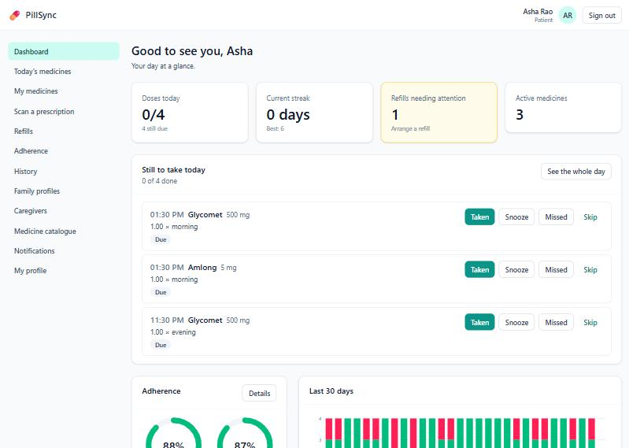
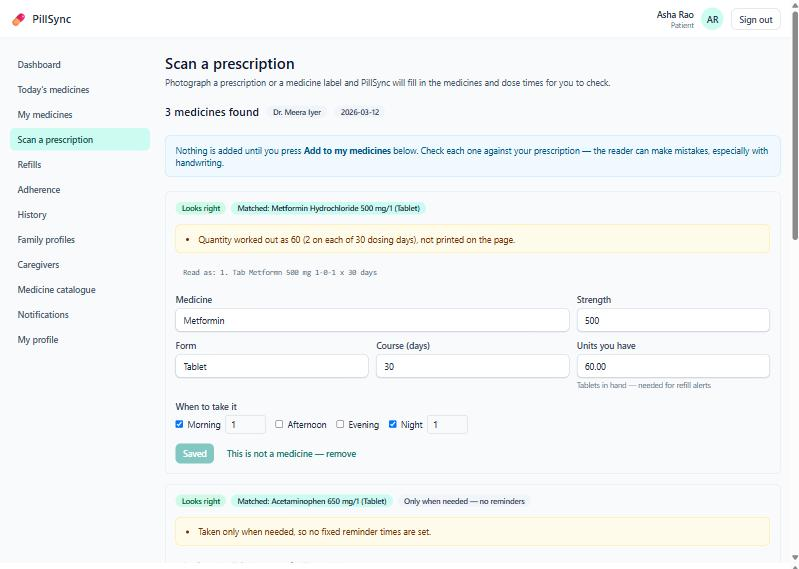
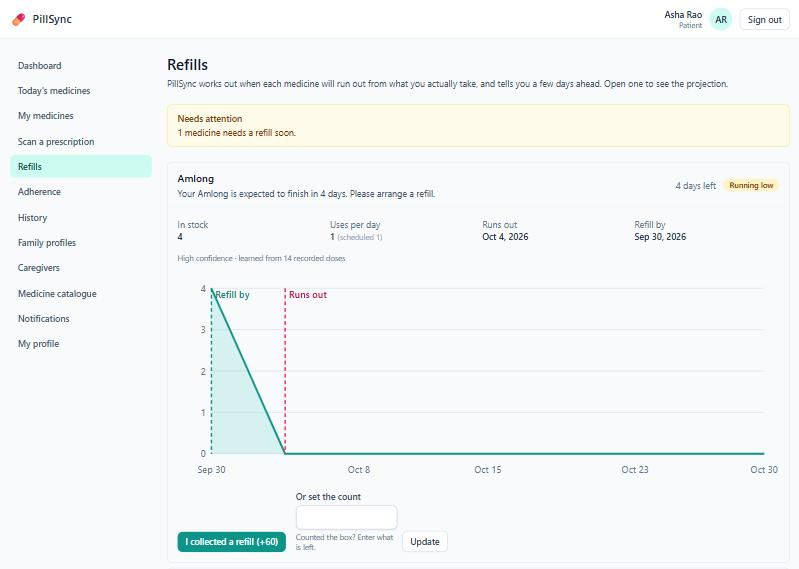
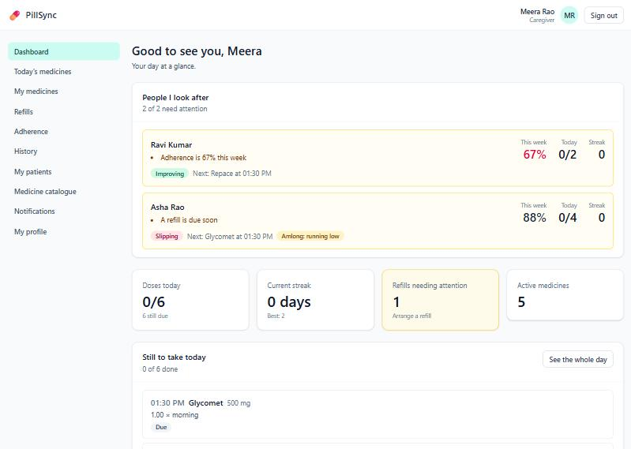
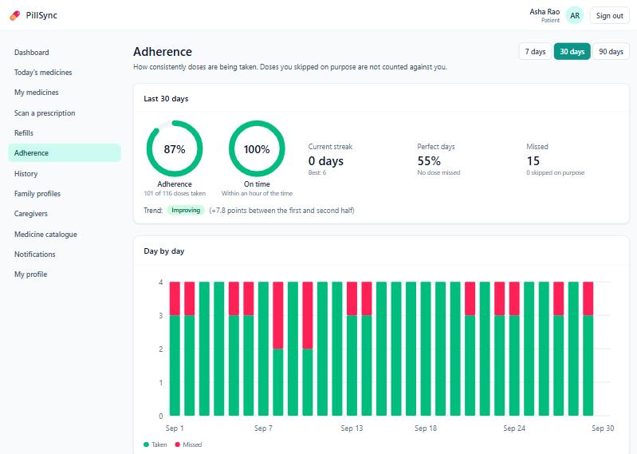

<!--
Render with Marp (VS Code extension "Marp for VS Code", or `npx @marp-team/marp-cli docs/demo/presentation.md --pdf`).
It is also readable as plain Markdown: each slide is separated by a line of three dashes, and the
speaker notes are in the HTML comments under each slide.
About 15 minutes: 11 slides plus the live demo (docs/demo/demo-script.md).
-->

# PillSync

**Intelligent medicine reminders and medication tracking**

Patients · Family members · Caregivers · Administrators

<!-- Say: PillSync helps people take the right medicine at the right time and tells them before it runs out. -->

---

## The problem

- People on several medicines miss doses, and run out without noticing.
- The person who goes to the pharmacy is often **not** the patient — an elderly parent's daughter.
- Prescriptions are paper, and re-typing them is where mistakes start.

**The failure that matters is not a crash. It is a confident wrong answer.**

<!-- Say: that last line drives every design decision that follows. -->

---

## What it does

| | |
|---|---|
| **Remind** | Dose reminders; Taken / Missed / Snooze / Skip; caregivers alerted on a miss |
| **Read** | Photograph a prescription; medicines and dose times are filled in **for the patient to check** |
| **Predict** | When each medicine runs out, learned from what the patient really takes |
| **Track** | Adherence, streaks, where the misses cluster; weekly and monthly reports |
| **Watch** | Caregiver overview ranks who needs a call, and why |

Two milestones per half: M1–2 the reminder platform, M3–4 the intelligence and delivery.

---

## Architecture



React SPA → nginx → Django REST (gunicorn) → PostgreSQL · Redis · Celery worker + beat.
Tesseract runs inside the backend image. Two container images, six processes.

<!-- Say: one row — the DoseEvent — is the reminder, the history record, and the adherence count. That decision removed a whole class of drift. -->

---

## Reading a prescription — safely

1. **Validate** the upload (size, format, pixel count from the header)
2. **Preprocess** and **read** with Tesseract (a confidence per word)
3. **Parse** with deterministic rules — `1-0-1`, `BD`, "twice daily", SOS…
4. **Match** to a 3,111-presentation catalogue
5. **Review** — nothing is saved until the patient confirms

**Uncertain means suggest, never apply.** A poorly read page downgrades *every* match to a suggestion.



<!-- Say: rules rather than an AI model, on purpose: exact, offline, and a wrong answer traces to a line of code. -->

---

## Predicting when it runs out

```
average use = w × observed + (1 − w) × scheduled
runs out    = today + stock ÷ average use          refill by = runs out − 5 days
```

The specification's example: **60 tablets at 2 a day → 30 days → 31 March**, refill by 26 March.

Warns **once per level** (low → critical → out), resets after a refill, tells the caregiver too.



---

## How well does it work? — measured, with the caveats

| | Result | Basis |
|---|---|---|
| OCR, clean text | **100%** of fields | Synthetic, 120 medicines, real Tesseract |
| OCR, badly degraded | 22.5% found; **0 wrong drugs applied** | Poor read ⇒ suggest only |
| Run-out date error | **5.3 days** (schedule alone: 8.9) | 1,000 *simulated* patients |
| Warned before running out | **100%**, median 6 days' notice | Same simulation |
| API latency | **median 33 ms**, p95 61 ms | Production stack |
| Load | **100 clients, 0 errors** | ~80 req/s on 2 workers, ~180 on 6 |

**These figures show the methods work — not the accuracy real patients and real photos would give.**

---

## What testing found

A green test suite hid the worst problems. Running the real thing found:

- ❗ **Every registration in production would have failed** — the password hasher was configured but not installed *(smoke test)*
- ❗ A parser bug **silently dropped reminders** for one prescribing style in six *(OCR evaluation)*
- ❗ A wrong drug could be **auto-matched** on a badly read page *(OCR evaluation)*
- ❗ My first load test was **wrong in a flattering way** — throttled requests counted as success
- ❗ Ten tests **failed depending on the time of day**

Each is fixed, and pinned by a test. **801 tests · 89.7% backend coverage · 20 deployment checks.**

<!-- Say: the lesson is to run the real system, and to measure on data the code was not tuned on. -->

---

## Live demo

**Asha** scans a prescription → reviews → confirms → sees her refill forecast → adherence patterns
**Meera** (her daughter, a caregiver) sees who needs a call, and why
**Admin** sees platform health

 

<!-- Follow docs/demo/demo-script.md. -->

---

## What is not done — stated plainly

- **Not deployed to a live host.** Packaged, tested as a running stack, documented for Render / AWS / Azure — but it needs an account that belongs to a person.
- **Reminders reach the console, not a phone,** until push / SMS / email credentials exist.
- **Handwriting is unsupported.** Real phone photos are unmeasured.
- **Prediction accuracy is unproven on real people**; changing habits are forecast late (~13 days).
- **It reminds and tracks. It does not check drug interactions** and is not a medical device.

---

## Next steps

1. Deploy to a staging host; run the 20-check smoke test against it
2. Real notification credentials; measure actual delivery
3. Consented real data → re-run the refill evaluation, add a trend term
4. A hosted OCR engine for handwriting; evaluate on real photos
5. Privacy and clinical-safety review before any real patient uses it

**Questions?**
