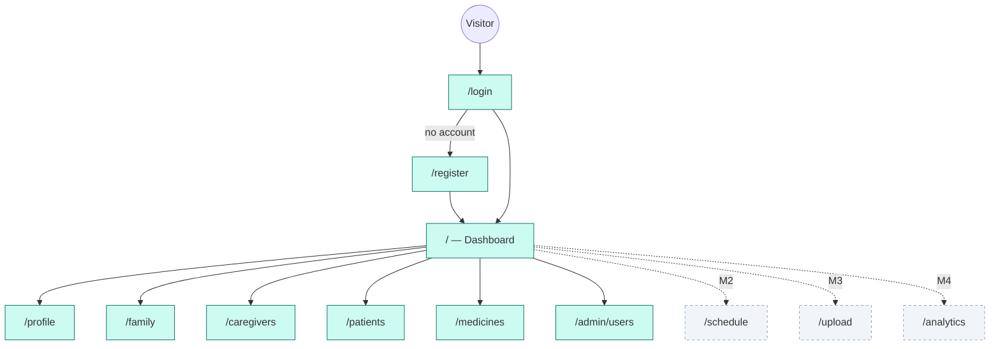

# Wireframes and screen flow

**Milestone 1 deliverable — "Create UI wireframes and workflow planning".**

These describe the screens built in Milestone 1 and the ones Milestones 2–4
slot into. Layout only; the implemented screens live in `frontend/src/pages/`.

## Design constraints

Many PillSync users are elderly or managing a parent's medicines under time
pressure. That drives three rules the components enforce:

1. **Focus rings are never removed.** Keyboard and screen-reader users have to
   be able to see where they are.
2. **Errors are announced, not just coloured.** `Alert` uses `role="alert"`,
   inputs carry `aria-invalid` and `aria-describedby`.
3. **One primary action per screen.** A patient who has just been reminded to
   take a pill should not have to choose between five buttons.

## Navigation



Role decides what appears in the sidebar, and `ProtectedRoute` enforces it:

| Route | Patient | Caregiver | Admin |
|---|---|---|---|
| `/` Dashboard | yes | yes | yes |
| `/profile` | yes | yes | yes |
| `/family` | yes | — | yes |
| `/caregivers` | yes | — | — |
| `/patients` | — | yes | — |
| `/medicines` | yes | yes | yes |
| `/admin/users` | — | — | yes |

That is a usability guard, not a security boundary — the API enforces the same
rules, because anything in the browser can be bypassed.

## Sign in

```
┌──────────────────────────────────────────┐
│                    💊                    │
│              Welcome back                │
│   Sign in to manage your medication      │
│                                          │
│  ┌────────────────────────────────────┐  │
│  │ [!] Incorrect email or password.   │  │  ← role="alert", only on failure
│  └────────────────────────────────────┘  │
│                                          │
│  Email address *                         │
│  ┌────────────────────────────────────┐  │
│  └────────────────────────────────────┘  │
│                                          │
│  Password *                              │
│  ┌────────────────────────────────────┐  │
│  └────────────────────────────────────┘  │
│                                          │
│  ┌────────────────────────────────────┐  │
│  │             Sign in                │  │  ← full width, one primary action
│  └────────────────────────────────────┘  │
│                                          │
│      New here? Create an account         │
└──────────────────────────────────────────┘
```

Registration is the same frame with name, phone, a role choice
(patient / caregiver — never admin) and a repeated password.

## Dashboard

```
┌────────────────────────────────────────────────────────────────────┐
│ 💊 PillSync                            Asha Patel · Patient  [out] │
├────────────┬───────────────────────────────────────────────────────┤
│ Dashboard  │  Good to see you, Asha                                │
│ My profile │  Milestone 1 covers your account, profiles and the     │
│ Family     │  medicine catalogue.                                  │
│ Caregivers │                                                       │
│ Medicines  │  ┌────────┐ ┌────────┐ ┌────────┐ ┌────────┐          │
│            │  │Profiles│ │Active  │ │Pending │ │Medicine│          │
│            │  │        │ │caregvr │ │request │ │catalog │          │
│            │  │   3    │ │   1    │ │   0    │ │  1764  │          │
│            │  └────────┘ └────────┘ └────────┘ └────────┘          │
│            │                                                       │
│            │  ┌─ Medicines by condition ────────────────────────┐  │
│            │  │  Blood Pressure  350   Diabetes         246     │  │
│            │  │  Thyroid         115   Antibiotics      352     │  │
│            │  │  Vitamins        350   Heart Meds       351     │  │
│            │  └─────────────────────────────────────────────────┘  │
│            │                                                       │
│            │  [M2: Today's doses]  [M3: Refill alerts]             │
└────────────┴───────────────────────────────────────────────────────┘
```

Each tile is a link. The two bracketed rows are where Milestone 2's dose list
and Milestone 3's refill warnings drop in — the grid already leaves room.

## Family profiles

```
┌─ Profiles (3) ─────────────────────────────────────────────┐
│  Asha Patel                       [You]                    │
│  34 years · 12 Mar 1992                                    │
│ ─────────────────────────────────────────────────────────  │
│  Asha's Mother                                 [Retire]    │
│  Parent · 71 years · 4 Apr 1955                            │
│ ─────────────────────────────────────────────────────────  │
│  Ravi (son)                                    [Retire]    │
│  Child · 8 years                                           │
└────────────────────────────────────────────────────────────┘

┌─ Add a family member ──────────────────────────────────────┐
│  Full name *              Relationship to you              │
│  ┌──────────────────┐     ┌──────────────────┐             │
│  └──────────────────┘     └──────────────────┘             │
│  A name you will recognise, e.g. 'Asha (mother)'           │
│                                                            │
│  Date of birth            Gender                           │
│  ┌──────────────────┐     ┌──────────────────┐             │
│  └──────────────────┘     └──────────────────┘             │
│                                                            │
│  [ Add profile ]                                           │
└────────────────────────────────────────────────────────────┘
```

"Retire" rather than "Delete": the profile is deactivated, because medication
history hangs off it from Milestone 2 onward.

## Caregivers (patient's view)

```
┌─ Caregiver links (2) ──────────────────────────────────────┐
│  Nina Sharma                             [Active]          │
│  nina@example.com                                          │
│  Nurse · requested 2 Sep 2026 · can see adherence, alerts  │
│                                            [ Revoke ]      │
│ ─────────────────────────────────────────────────────────  │
│  Dev Kumar                               [Pending]         │
│  dev@example.com                                           │
│  Family · requested 4 Sep 2026                             │
│                             [ Accept ]  [ Decline ]        │
└────────────────────────────────────────────────────────────┘

┌─ Invite a caregiver ───────────────────────────────────────┐
│  Caregiver's email *          Relationship                 │
│  ┌──────────────────┐         ┌──────────────────┐         │
│  └──────────────────┘         └──────────────────┘         │
│  They must already have a caregiver account.               │
│                                                            │
│  What they may do                                          │
│  [x] See whether doses were taken                          │
│  [x] Receive missed-dose and refill alerts                 │
│  [ ] Add and change medicines        ← off by default      │
│                                                            │
│  [ Send request ]                                          │
└────────────────────────────────────────────────────────────┘
```

The permission checkboxes make the grant explicit at the moment of sharing.
"Add and change medicines" starts unchecked, because seeing a schedule and
changing it are very different levels of trust.

## Medicine catalogue

```
┌────────────────────────────────────────────────────────────┐
│  Search                                                    │
│  ┌────────────────────────────────┐  [ Search ]            │
│  │ metformin                      │                        │
│  └────────────────────────────────┘                        │
│                                                            │
│  (Blood Pressure 350) (Diabetes 246) (Thyroid 115)         │
│  (Antibiotics 352) (Vitamins 350) (Heart Meds 351)         │
│                            ↑ toggles, aria-pressed         │
├────────────────────────────────────────────────────────────┤
│  84 medicines                                              │
│                                                            │
│  Metformin Hydrochloride   500 mg    [Diabetes] [Rx]       │
│  Glucophage · Tablet, Film Coated · Oral                   │
│  Biguanide [EPC]                                           │
│ ─────────────────────────────────────────────────────────  │
│  Metformin Hydrochloride   850 mg    [Diabetes] [Rx]       │
│  Tablet, Film Coated · Oral                                │
│                                                            │
│  [ Previous ]           Page 1              [ Next ]       │
└────────────────────────────────────────────────────────────┘
```

This screen is scaffolding for later milestones: in Milestone 2 selecting a row
starts a schedule, and in Milestone 3 it is what OCR output is matched against.

## Later milestones

| Screen | Milestone | Purpose |
|---|---|---|
| Today's doses, schedule editor | 2 | Take / Miss / Snooze against a timeline |
| Upload prescription, OCR review | 3 | Camera or file upload, then correct the extracted fields |
| Refill forecast | 3 | Days of stock remaining, recommended refill date |
| Adherence analytics | 4 | Percentage, streaks, weekly and monthly reports |
| Caregiver monitoring | 4 | Missed doses across every assigned patient |

Each reuses the shell, the card grid and the components in
`src/components/common/`, so later work is screens, not a second design system.
